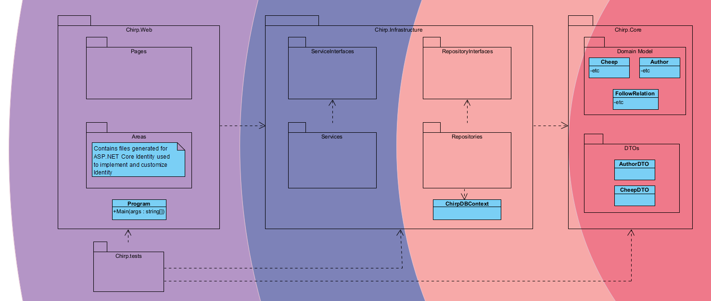
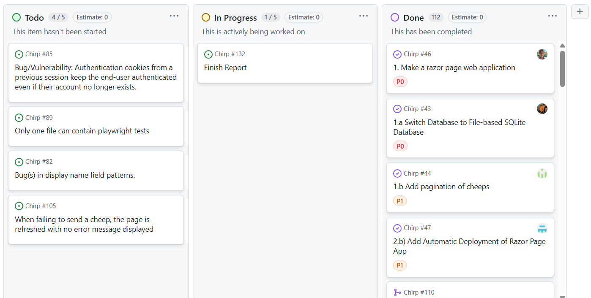
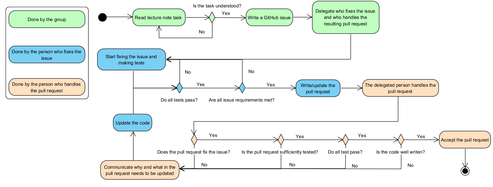

# Introduction
This report documents the process and the product of group 7's work from the course Analysis, Design and Software Architecture in 2025 at the IT University of Copenhagen. The final product named *Chirp!* can be found at the [GitHub repository](https://github.com/ITU-BDSA2025-GROUP7/Chirp). The application is hosted on Azure and is available [*here*](https://bdsagroup7chirprazor-buhcfwanakgyaabx.germanywestcentral-01.azurewebsites.net/). Group 7 consists of 5 people who have all contributed to the final product and its documentation:

- Nikki Skarsholm Risager <nris@itu.dk>
- Louis Falk Knudsen <lofk@itu.dk>
- Hassan Hamoud Al Wakiel <halw@itu.dk>
- Kristoffer Mejborn Eliasson <krme@itu.dk>
- Mette My Dvinge Gabelgaard <mmga@itu.dk>

Eduard Kamburjan was the course manager and Sven Matthias Peldszus teaching. The following sections document the final product, and the decisions that were made underway.


# Design and Architecture of _Chirp!_

## Domain model

The database for the project is an SQLite database that's using Entity Framework Core as an object-relational mapper,
allowing the creation of a domain model containing classes that can be used as tables within the database while also allowing the use of these classes in the code.

The domain model of Chirp! consists of a couple of different classes. The two main classes are `Author` and `Cheep`.

`Author` represents a user in the program. It contains all relevant information about the user such as *UserName*, *DisplayName*, *Email*, *PasswordHash*, and a list of all cheeps that the author wrote.
Much of the functionality is inherited from `IdentityUser` as part of ASP.NET Identity.
This allows the use of functionality from ASP.NET identity such as support for registration, login page, as well as offloading some of the security concerns to Dotnet.
An author can also follow another author. This is done using the `FollowRelation` class. It contains the *Follower*, the *Followed* and a unique id representing the FollowRelation, allowing for a many-to-many relation between authors.
The reason for creating a separate class was to maximize the normal form of the database.
The course *Introduction to database systems* taught that it was best to achieve this by spitting the functionality of authors following each other into a separate table.
In hindsight, it would have been just as valid to add a field `public List<Author> Follows` to `Author` as EF Core separates the list into a separate table behind the scenes.

`Cheep` represents a message from a user. It contains relevant information such as the author who wrote it, what time it was written, the text message itself and a unique Id.

Below is shown a UML diagram depicting the structure of the domain model. Note that only the relevant fields of `IdentityUser` are shown.

*Diagram 1. Displays the domain model of the program.*

## Architecture — In the small


*Diagram 2. Displays the structure of the program arranged in an Onion Architecture arranged with the core to the right.*

The application is constructed in concentric layers using the domain model as a center.
Each layer can depend on layers below it, but not above it.

- **The Domain Layer:** This layer contains the classes described in the Domain model section. The layer also contains the `DTO` classes `AuthorDTO` and `CheepDTO` that our repositories and services use.
- **The Repository Layer:** This layer contains the interfaces and classes for our repositories. Rather than using one generic repository, `AuthorRepository` and its interface `IAuthorRepository` handles `Author`s, while `CheepRepository` and `ICheepRepository` handles `Cheep`s. This layer also contains the class `ChirpDBContext` which inherits the ASP.NET Core class `IdentityDBContext`.
- **The Service Layer:** In the service layer there are classes and interfaces related to services. These follow the same structure as the one for repositories, with separate classes and interfaces for `Author` and `Cheep`.
- **The UI Layer:** This is the layer for all the cshtml code used for the frontend. This includes both code generated by ASP.NET Core, as well as our own code. This is also where the `Program.cs` class that launches the entire app is located.

The application uses Razor pages for the application, which lets us use .cshtml files for the frontend. The `PageModel` class provides similar functionality to the Code-behind model in `System.Web.UI` to write C# code for the .cshtml pages. For user validation and authorization the ASP.NET Core Identity framework was used, the code for which can be found in the `Chirp.Web.Areas` folder. The Identity framework is used to implement the various functionality described later in the User activities section.

## Architecture of deployed application
The application is deployed to an application server owned by the vendor Microsoft Azure
at \
https://bdsagroup7chirprazor-buhcfwanakgyaabx.germanywestcentral-01.azurewebsites.net/.

The following deployment diagram shows the most relevant (out of several hundred) artifacts which
are included as part of the composite `.net-app` artifact that is deployed to the application server.


*Diagram 3. Deployment diagram*

## User activities
In Chirp!, users can do many actions such as logging in, writing cheeps, following other users and much more.

The diagram below illustrates what the typical journey of an unauthorized user may look like, where the goal of the user is logging into the application. The initial node represents opening the application and the final node is logging in using the login page.

 \
*Diagram 4. Potential user journey of an unauthorized user*

Authorized users can do a lot more activities than unauthorized.
The diagram below illustrates what the typical journey of an authorized user may look like. The initial node represents logging into the account, and the final node is logging out which can also be done by deleting the account.

 \
*Diagram 5. Potential user journey of an authorized user*

## Sequence of functionality/calls through _Chirp!_

The Chirp application contains a bunch of different calls, between various parts of the application.
The diagram below shows the calls made when an unauthorized user visits the page.

 \
*Diagram 6. Sequence diagram of the calls made when the unauthorized user goes to the root.*

Starting when an unauthorized user goes to the root endpoint of the application. In this case the public timeline.

Whenever a user attempts to retrieve the public timeline page, they send a GET request to the public timeline which is handled on the ``PublicModel``.
The method ``GetCheeps()`` is called on the ``CheepService``,
which calls the method of the same name on ``CheepRepository``. The repository fetches the cheeps from the database.
In the diagram that is denoted by SELECT cheeps, which is not the full LINQ statement. The full statement takes pagination and ordering into account for fetching cheeps.
On the diagram, the full statement was left out for simplicity.


The ``GetCheeps`` methods are all asynchronous and therefore return ``Task<List<CheepDTO>``. These can be converted into ``List<CheepDTO>`` using the ``await`` keyword. The list can then be used to render the UI.
In the end, the client receives an HTTP response message with the code 200, meaning ok along with the HTML page.

# Process

## Build, test, release, and deployment

The processes of building, testing, releasing and deploying are relatively simple and always follow the same pattern making them simple to automate.
For this reason, there has been added a total of 3 GitHub actions to automate these processes. The actions are as follows: *BuildAndTest*, *Release*, and *Deploy*.
Each GitHub action has a trigger that activates the action. These differ from each action.

### Build And Test
The purpose of the *BuildAndTest* action is, as the name implies, to ensure that the project is always buildable and that each test passes.
The integration with GitHub makes this action highly useful as the action can be run on a pull request,
and GitHub will point out any compiler warnings as well as disallowing the pull request to be accepted if any tests fail.

The action is activated whenever a push or pull request is made.
After the action has successfully built the project, then it will download playwright.
This is because the *ubuntu-latest* machine that the action runs from doesn't have playwright installed, and it's required for some of the tests.
It then runs the tests.
If there was a problem with any of the steps involved, then the action will fail and a potential pull request will be marked as not suitable for merging.

The action is illustrated in the UML activity diagram below.

 \
*Diagram 7. Illustrates the BuildAndTest action*

### Release
The purpose of the *Release* action is to automate the process of making a GitHub release.

It's activated when a push is made with a tag that fits the regular expression `v[0-9]+.[0-9]+.[0-9]+`.
It first runs what's equivalent to the *BuildAndTest* action, testing that all tests pass before proceeding.
Once this is done, the action can publish the program. It is published three times, once for Windows, Mac, and Linux.
The published program does not contain the database required to run the program. For this reason, the database is also copied to each of the published programs.
After this is done, all three programs can be zipped and released

The action is illustrated in the UML activity diagram below.

 \
*Diagram 8. Illustrates the Release action*

### Deploy
The purpose of the *Deploy* action is to deploy the program from GitHub onto Azure, making the program publicly accessible from the website.

The code for the action is based on the code provided by Azure when creating a new webapp.
It's activated whenever something is pushed to main, ensuring that the program that's live on Azure is always up to date with the current state of the main branch.

The action is illustrated in the UML activity diagram below.

 \
*Diagram 9. Illustrates the Deploy action*

## Team work
The teamwork in the group has been one of good communication.
Before the project work began, a meeting was held to discuss how the group work should be carried out.
Here it was agreed to hold two meetings each week. Both after a lecture where access to TA's were available.
It was also discussed whether each member would prefer working in groups or alone, along with expectations for working in the weekends and while on vacation.
An agreement was made that whenever someone was done with their issue, they would make a pull request.
The pull request would be reviewed by a member not associated with the creation of the pull request.
When handling a pull request, the reviewer should review based on code quality, the requirements for fixing the issue, along with sufficient testing.
It was agreed that if a feature was not sufficiently tested, then the feature was assumed to be non-functional and therefore could not be approved.
This resulted in higher test coverage and less faulty code.

The purpose of the meetings would be to discuss how much progress has been made since last meeting,
discuss and create new issues based on the lecture notes, delegate the issues to the group members, and discuss any potential collaboration between groupmates.
The work on the project would then be carried out in between meetings, allowing for flexible working hours.


Below is shown the GitHub project board shortly before handing in the report. It contains issues that are marked as either complete, in progress or to-do.

 \
*Diagram 10. Project board showing the status of the project shortly before hand-in*

Most of the issues are done. The four issues that are left in to-do are all bug fixes or quality of life improvements. These are:

- A bug where the authentication cookie of a logged-in user is still alive in the browser even after deleting the user directly from the database. This can be replicated by switching branches where the user does not exist in one of the branches. Thereby *'deleting'* the user by switching branches.
- A bug where registering a user with no `DisplayName` will cause an issue, because the `DisplayName` is equal to the `Username` when `DisplayName` is blank. `Username` and `DisplayName` does not have the same restraints, this can leave the user with an illegal `DisplayName`.
- There is no error message displayed to the user if, for some reason, a Cheep failed to be sent.
- An issue making it impossible to have multiple .cs files that contain PlaywrightTests.

It has been chosen not to complete the above issues, due to time constraints and that the issues do not massively affect the end user.

Below is a diagram showing the process from the creation to completion of an issue.
Starting from receiving a task from the lecturer or from finding a bug in the program:

 \
*Diagram 11. Illustrates the process of creating and handling issues*


If any step of the diagram proved difficult, like if a lecture note task was ambiguous or a feature was particularly hard to write tests for, help from TA's proved useful.

In this process we tried to follow trunk based development principles of short-lived branches, but ultimately followed more of a feature based strategy.
This was because work on other courses made trunk based development difficult.

## How to make _Chirp!_ work locally

### Setup
#### Dependencies

The application requires you to have installed [.NET 9.0](https://dotnet.microsoft.com/en-us/download)
or later.
Any other missing dependencies should be automatically installed when building/running the program.

#### User secrets
For the program to work locally, a "user secret" related to GitHub authentication must be set.\
Two values, a _client ID_ and a _client secret_, need to be obtained directly from
GitHub through their interface for [registering a new OAuth app](
https://docs.github.com/en/apps/oauth-apps/building-oauth-apps/authenticating-to-the-rest-api-with-an-oauth-app).\
When prompted, you can set the "Homepage URL" to `http://localhost:5273/`,
and the "Authorization call-back URL" to `http://localhost:5273/signin-github`.

Execute the following console commands while standing in `src/Chirp.Web`. Replace `<client ID>` and `<client secret>` with
the respective values.
```
dotnet user-secrets set "authenticationGitHubClientId" <client ID>
```
```
dotnet user-secrets set "authenticationGitHubClientSecret" <client secret>
```

If anything goes wrong, the user secret settings can be reset by executing the following commands in order, also standing in `src/Chirp.Web`:
```
dotnet user-secrets clear
```

```
dotnet user-secrets init
```

### Run
To build and start the program on an available port, execute the following command in a terminal
emulator while standing in the project root:

```
dotnet run --project src/Chirp.Web
```

or, if you have an implementation of Make installed,

```
make start
```

A message in the console will inform you of the specific URL to navigate to in your browser in
order to interact with the web application. Depending on your terminal emulator, you may be able to simply
click the link to do so directly.

## How to run test suite locally
To run the test suite, the program does *not* need to be running locally in the background. Running the test suite can be done in two ways, depending on if Make is installed on your local computer.
If it is installed, running this command from the root directory will start the test suite:
```
make test
```
Alternatively if Make is not installed, running the following command from the root directory will start the test suite:
```
dotnet test
```

The test suite consists of 111 tests. There are three types of tests in the suite:

1. Unit tests: Tests a singular method, class, or field.
2. Integration tests: Tests the interplay between classes and methods.
3. End-to-end tests: Tests the product as interacted with by the user. This is done through Playwright

Here is a brief list of what is being tested

##### Author Repository

1. Creating authors
2. Following authors
3. Retrieving Authors
4. Deleting Authors
5. AuthorDTO works as expected
6. CheepDTO works as expected

##### Cheep Repository

1. Retrieving Cheeps
2. Retrieving pages of cheeps
3. Cheep timestamps are correct
4. Creating cheeps
5. Cheep content
6. Safe from SQL-injection
7. Retrieving cheeps from user that follows another, also retrieves the followed user

##### Playwright tests

1. User can log in
2. User can register
3. Navigation bar changes
4. Users can log out
5. Users can follow & unfollow
6. About me has following page
7. My page shows displayName
8. Cheeps are shown
9. Deleting users
10. Users can send cheeps
11. Sending cheeps are safe from XSS attacks
12. Users can Delete cheeps
13. About me page exists
14. Page arrows work
15. Users can search for users

# Ethics

## License
To choose our license, we first looked at the dependencies of our project. And registered that we
are only using Microsoft libraries.

We chose the MIT license because it is simple and to the point. It is the one .Net uses, and we do not
have anything else that should not comply with it, since no obscure libraries are used in this application.

The MIT license allows other people to use our code, and since we are not a business trying to earn money from the project,
there is no particular reason or fear that someone will copy the project and distribute it commercially.
Therefore, we have no need to gatekeep our code and want to take part in the sharing of code.

## LLMs, ChatGPT, CoPilot, and others
We have used the free version of ChatGPT in a limited scope during development. To gather the group's
thoughts on the topic an informal interview was used to guide the conversation around important
topics about AI use and its role in the project. Most of the team have had some prior experience
when using AI. ChatGPT was in all but one case used in a way similar to Google, for looking up
information on problems the team was facing. The output of ChatGPT was then used as a basis for what
to look into, statements made by the AI were compared to what other students and sources had to say
about the subject.
The only time code from ChatGPT was used directly in the project was this specific line that solved an issue we had been working on for quite some time.
```
builder.Services.AddDefaultIdentity<Author>(options => {
    options.User.RequireUniqueEmail = true;
})
```

Overall each team member of the group are skeptical that AI use is particularly helpful overall,
each member who have used AI have generally had a low amount of confidence that the details of the
output was correct. Furthermore, even when correct on a specific topic, team members report that other
prompts relating to the same topic might not necessarily produce correct information. Team members
also did not find AI to be any more helpful than other sources of information, it at best served as
a complement to lecture slides, text books, official documentation, online guides,
other students and TAs.

Finally, several of the team members reported dissatisfaction with dealing with AI. One reported
that it was less enjoyable than dealing with coding problems directly. Another member reported that
the existence of AI tools itself robbed them of some of the joy of programming, that you feel like
you're being inefficient if you don't use it, but that using it removes the creative problem-solving
aspect of programming.