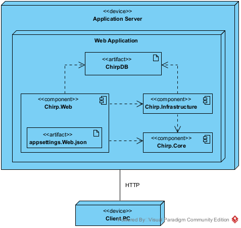
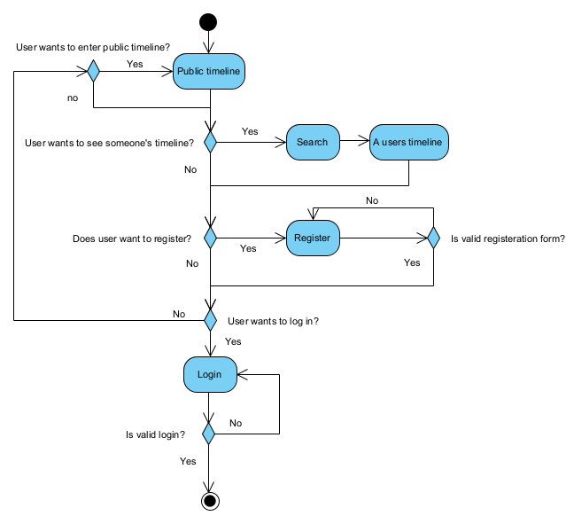
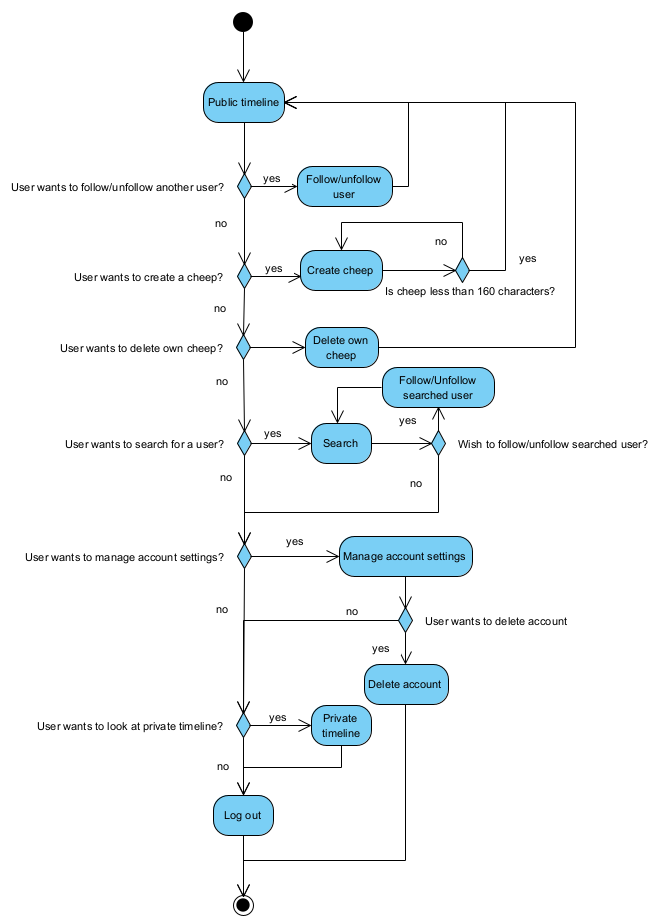
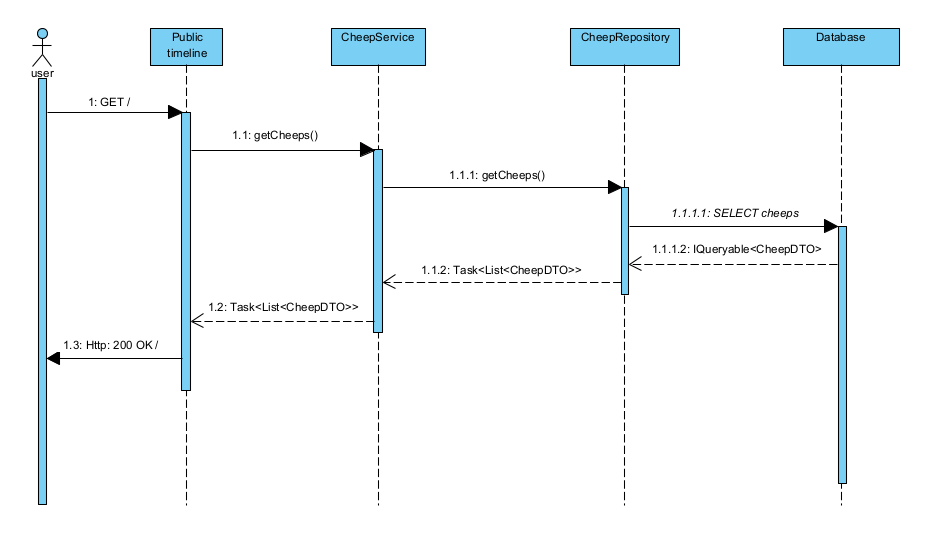
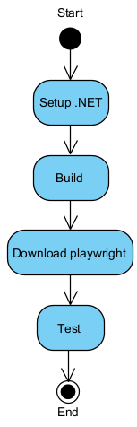
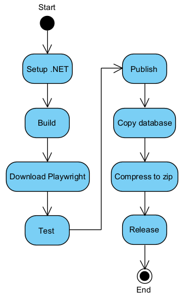
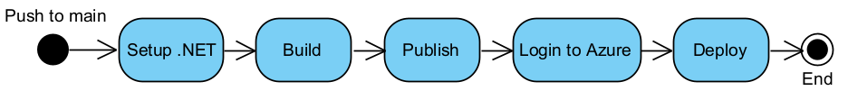

# Introduction (Hassan)
This report documents the process and the product of group 7's work from the course Analysis, Design and Software Architecture in 2025 at the IT University of copenhagen. The final product can be found at the [Github repository](https://github.com/ITU-BDSA2025-GROUP7/Chirp). An azure hosted [Website](https://bdsagroup7chirprazor-buhcfwanakgyaabx.germanywestcentral-01.azurewebsites.net/) with the final product will also be available temporarily. Group 7 consists of 5 people who have all contributed to the final product and it's documentation:
- Nikki Skarsholm Risager <nris@itu.dk>
- Louis Falk Knudsen <lofk@itu.dk>
- Hassan Hamoud Al Wakiel <halw@itu.dk>
- Kristoffer Mejborn Eliasson <krme@itu.dk>
- Mette My Gabelgaard <mmga@itu.dk>

With Eduard Kamburjan as the course manager and Sven Matthias Peldszus as a teacher. The following sections documents the final product, and the decisions that were made.


# Design and Architecture of _Chirp!_

## Domain model

The database for the project is an SQLite database that's using Entity Framework Core as an object-relational mapper,
allowing the creation of a domain model containing classes that can be used as table withing the database while also allowing the use of these classes in the code.

The domain model of Chip consists of a couple of different classes. The two main classes are `Author` and `Cheep`.

`Author` represents a user in the program. It contains all relevant information about the user such as *UserName*, *DisplayName*, *Email*, *PasswordHash*, and a list of all cheeps that the author wrote.
Much of the functionality is inherited from `IdentityUser` as part of ASP.NET Identity.
This allows the use of functionality from ASP.NET identity such as support for registration, login page, as well as offloading some of the security concerns to Dotnet.
An author can also follow another author. This is done using the `FollowRelation` class. It contains the *Follower*, the *Followed* and a unique id representing the FollowRelation, allowing for a many-to-many relation between authors.
The reason for creating a separate class was to maximize the normal form of the database.
The course *Introduction to database systems* taught that it was best to achieve this by spitting the functionality of authors following each other into a separate table.
In hindsight, it would have been just as valid to add a field `public List<Author> Follows` to `Author` as EF Core separates the list into a separate table behind the scenes.

`Cheep` represents a message from a user. It contains relevant information such as the author who wrote it, what time it was written, the text message itself and a unique Id.

Below is shown a UML diagram depicting the structure of the domain model. Note that only the relevant fields of `IdentityUser` are shown.


## Architecture — In the small (Kris)

## Architecture of deployed application (Louis)
The application is deployed to an application server owned by the vendor Microsoft Azure
at https://bdsagroup7chirprazor-buhcfwanakgyaabx.germanywestcentral-01.azurewebsites.net/.

The following deployment diagram shows the most relevant (out of several hundred) artifacts which
are included as part of the composite `.net-app` artifact that is deployed to the application server.



## User activities (Hassan)
The diagram below illustrates what the typical journey of an unauthorized user may look like, where the goal of the user is logging into the application. where the initial node is opening the application and the final node is logging in, on the login page.



The diagram below illustrates what the typical journey of an authorized user may look like. The initial node represents logging into the account, and the final node is logging out which can also be done by delete the account.



## Sequence of functionality/calls trough _Chirp!_ (My)

The Chirp application contains a bunch of different calls, between various parts of the application.
The diagram below shows the calls made when an unauthorized user visits the page.


*Diagram ??. Sequence diagram of the calls made when the unauthorized user goes to the root.*

Starting when an unauthorized user goes to the root endpoint of the application. In this case the public timeline.

The fact that the user goes to the public timeline, sends a GET request to the public timeline which is handled on the ``PublicModel``.
The method ``GetCheeps()``is called on the ``CheepService``,
which calls the one in the ``CheepRepository``, this one fetches the cheeps from the database.
In the diagram that is denoted by SELECT cheeps, which is not the complete select statement, since
we take pagination into account for fetching cheeps, but on the diagram we care about the intent not the complete statement.


The ``GetCheeps`` methods are all asynchronous and therefore they return ``Task<List<CheepDTO>`` instead of just a list of cheep data transfer objects.
That the UI can render.
It all ends with the http message 200, meaning ok, this is the standard response when a request is successful.

# Process

## Build, test, release, and deployment

The processes of Building, testing, releasing and deploying are relatively simple and always follow the same pattern making them simple to automate.
For this reason, there has been added a total of 3 GitHub actions to automate these processes. The actions are as follows: *BuildAndTest*, *Release*, and *Deploy*.
Each GitHub action has its own trigger that activates the action. These differ from each action.

### Build And Test
The purpose of the *BuildAndTest* action is, as the name implies, to ensure that the project is always buildable and that each test passes.
The integration with GitHub makes this action highly useful as the action can be ran on a pull request,
and GitHub will point out any compiler waning as well as disallowing the pull request to be accepted if any tests fail.

The action is activated whenever a push or pull request is made.
After the action has successfully built the project, then it will download playwright.
This is because the *ubuntu-latest* machine that the action is ran from doesn't have playwright installed, and it's required for some of the tests.
It then runes the tests.
If there was a problem with any of the steps involved, then the action will fail and a potential pull request will be marked as not suitable for merging.

The action is illustrated in the UML activity diagram below.



### Release
The purpose of the *Release* action is to automate the process of making an GitHub release.

It's activated when a push is made with a tag that fits the regex expression `v[0-9]+.[0-9]+.[0-9]+`
It firsts runs what's equivalent to the *BuildAndTest* action, testing that all tests pass before proceeding.
Once this is done, the action can publish the program. It is published 3 times, once for Windows, Mac, and Linux.
The published program does not contain the database required to run the program. For this reason, the database is also copied to each of the published programs.
After this is done, alle 3 programs can be zipped and released

The action is illustrated in the UML activity diagram below.



### Deploy
The purpose of the *Deploy* action is to deploy the program form GitHub onto Azure, making the program publicly assessable from the website.

The code for the action is based on the code provided by Azure when creating a new webapp.
It's activated whenever something is a pushed to main, insuring that the program that's live on azure is always up to date with the current state of the main branch.

The action is illustrated in the UML activity diagram below.



## Team work (Kris)

## How to make _Chirp!_ work locally (Louis)

### Setup
#### Dependencies

The application requires you to have installed [.NET 9.0](https://dotnet.microsoft.com/en-us/download)
or later.
Any other missing dependencies should be automatically installed when building/running the program.

#### User secrets
For the program to work at all, a "user secret" related to GitHub authentication must be set.\
Two values, a _client ID_ and a _client secret_, need to be obtained directly from
[GitHub](https://www.github.com) through their interface for [registering a new OAuth app](
https://docs.github.com/en/apps/oauth-apps/building-oauth-apps/authenticating-to-the-rest-api-with-an-oauth-app).\
When prompted, you can set the "Homepage URL" to `http://localhost:5273/`,
and the "Authorization call-back URL" to `http://localhost:5273/signin-github`.

Execute the following console commands (omitting the optional portion in brackets if
already standing in the `src/Chirp.Web` directory). Replace `<client ID>` and `<client secret>` with
the respective values.
```
dotnet user-secrets set "authenticationGitHubClientId" <client ID> [--project src/Chirp.Web]
```
```
dotnet user-secrets set "authenticationGitHubClientSecret" <client secret> [--project src/Chirp.Web]
```

If anything goes wrong, the user secret settings can be reset by executing the following commands in order:
```
dotnet user-secrets clear [--project src/Chirp.Web]
```

```
dotnet user-secrets init [--project src/Chirp.Web]
```

### Run
To build and start the program on an available port, execute the following command in a terminal
emulator while standing in the project root:

```
dotnet run --project src/Chirp.Web
```

or, if you have an implementation of Make installed,

```
make start
```

A message in the console will inform you of the specific URL to navigate to in your browser in
order to interact with the web application. Depending on your terminal emulator, you may be able to simply
click the link to do so directly.

## How to run test suite locally
To run the test suite, the program does *not* need to be running locally in the background. Then running the test suite can be done in two ways, depending on if Make is installed on your local computer.
If it is installed, running this command from the root directory will start the test suite:
```
make test
```
Alternatively if Make is not installed, running the following command from the root directory will start the test suite:
```
dotnet test
```

The test suite comprises of (Insert number) tests. There are 3 types of tests in the suite:
1. Unit tests: Tests a singular function, class, or field.
2. Integration tests: Tests the interplay between classes and functions.
3. End to end tests: Tests the product as interacted with by the user. This is done though playwright

Here is a breath list of what is being tested

##### Author Repository
1. Creating authors
2. Following behaves as expected
3. Retrieving Authors
4. Deleting Authors
5. AuthorDTO works as expected
6. CheepDTO works as expected

##### Cheep Repository
1. Retrieving Cheeps
2. Retrieving pages of cheeps
3. Cheep timestamps are correct
4. Creating cheeps
5. Cheep content
6. SQL-injection safe
7. Retrieving cheeps from user that follows another, also retrieves the followed user

##### Playwright tests
1. User can log in
2. User can register
3. Navigation bara changes
4. Users can Log out
5. Users can Follow & unfollow
6. About me has following page
7. My page shows displayName
8. Cheeps are shown
9. Deleting users
10. Users can Sending cheeps
11. Sending cheeps ae safe from XSS attacks
12. Users can Delete cheeps
13. About me page exists
14. Page arrows work
15. Users can search for users

# Ethics

## License (My)
To choose our license, we first looked at the dependencies of our project. And registered that we
are only using Microsoft libraries.

We chose the MIT license because it is simple and to the point. It is the one .Net uses. and we don’t
have anything else that shouldn't work with it, since no obscure libraries are used in this application.

The MIT license allows other people to use our code, and since we are not a business trying to earn money from the project.
There is no particular reason or fear that someone will copy the project and distribute it commercially,
Therefore, we have no need to gatekeep our code and want to take part in the sharing of code.

## LLMs, ChatGPT, CoPilot, and others (Kris)